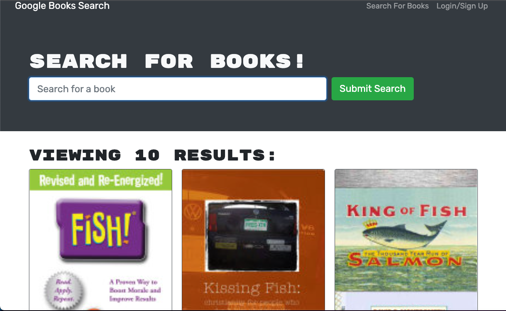
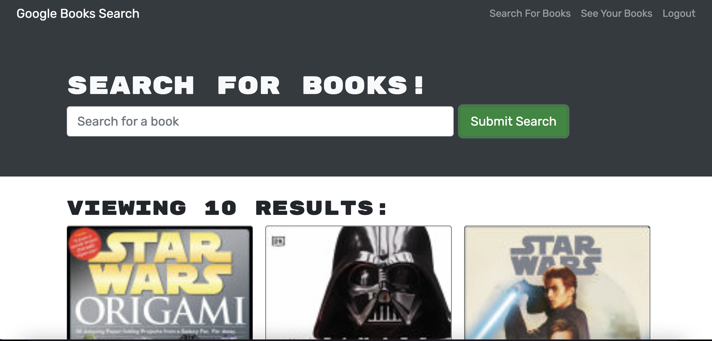

# Book Search Engine

### License

---

## Description

The Book search engine is an application is leveraging the entire MERN stack and with a React front end, MongoDB database, and Node.js/Express.js server and API. It's set up to allow users to save book searches to the back end. The application is built using Google Books API search engine build with GraphQL API and Apollo Server.

This project was bootstrapped with Create React App.

---

## Table of Contents

1. [Installation](#installation)
2. [Usage](#usage)
3. [Test](#test)
4. [Questions](#questions)

---

## Installation Instructions

The user should clone the repository from GitHub and download Node.js. This application also requires to npm install node_modules, package-lock.json, and npm run build

---

## Usage Information

- GIVEN a book search engine WHEN I load the search engine THEN I am presented with a menu with the options Search for Books and Login/Signup and an input field to search for books and a submit button WHEN I click on the Search for Books menu option THEN I am presented with an input field to search for books and a submit button WHEN I am not logged in and enter a search term in the input field and click the submit button THEN I am presented with several search results, each featuring a book’s title, author, description, image, and a link to that book on the Google Books site WHEN I click on the Login/Signup menu option

 [Deploy](https://obscure-coast-46270.herokuapp.com/)

---

## Test ScreenShot

## Questions

### GitHub Profile:

https://github.com/TottoMoe

### Contact Me:

If you have any additional questions, please send me an email.

#### jennydhj@gmail.com

---
